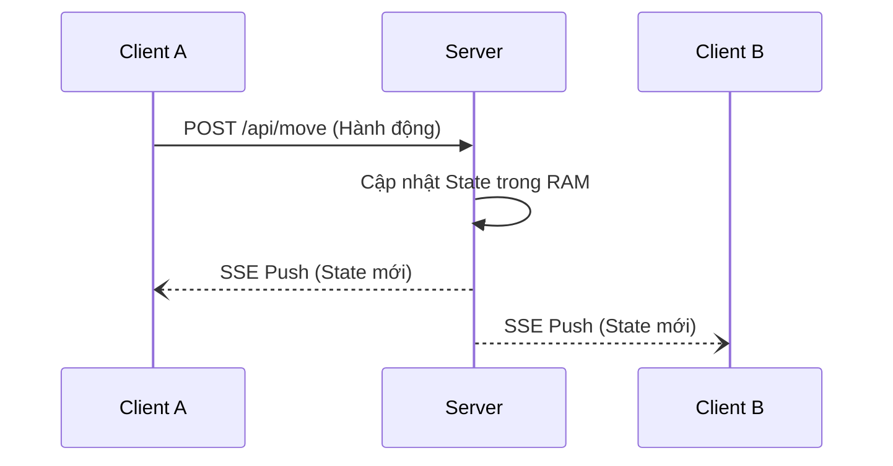

# 🚀 Dự Án Monolith SSE Thời Gian Thực (NestJS + Vue 3)

## 📚 Tài Liệu Tham Khảo

Chúng tôi có đính kèm tài liệu chi tiết về công nghệ Server-Sent Events (SSE) được sử dụng trong dự án này:

* **[📖 Đọc tài liệu giới thiệu về SSE](./docs/sse-intro.html)** *(Hãy tải file về hoặc mở trực tiếp bằng trình duyệt để xem nội dung)*

## 📋 Tổng Quan Kiến Trúc

Chúng ta sử dụng cấu trúc **Monolith** để đơn giản hóa quá trình phát triển.
* **Backend:** NestJS (Cổng `3000`)
* **Frontend:** Vue 3 + Vite (Cổng `5173`)
* **Giao thức giao tiếp:**
    * **Client -> Server:** Request HTTP chuẩn phương thức `POST` (Ví dụ: "Vào phòng", "Di chuyển").
    * **Server -> Client:** Luồng **SSE Stream** một chiều (Server chủ động đẩy cập nhật `GameState` xuống).



---

## 🛠️ Cấu Trúc Dự Án

Chúng ta coi frontend như một "dự án con" nằm bên trong backend.

```text
/
├── src/                  # Code Backend NestJS
│   ├── app.controller.ts # Xử lý routes HTTP & luồng SSE
│   └── app.service.ts    # Logic Game & Quản lý State
├── client/               # Code Frontend Vue 3
│   ├── src/              # Các Component Vue
│   └── vite.config.ts    # Đã cấu hình proxy /api -> localhost:3000
└── package.json          # Dependencies của Backend

```

---

## ⚙️ Cài Đặt & Thiết Lập

Vì dự án có **hai** file `package.json` (một cho backend, một cho frontend), bạn cần cài đặt thư viện cho cả hai nơi.

### 1. Cài đặt Backend

Chạy lệnh này tại thư mục gốc (root):

```bash
npm install

```

### 2. Cài đặt Frontend

Di chuyển vào thư mục client và cài đặt:

```bash
cd client
npm install
cd ..

```

---

## 🏃‍♂️ Cách Chạy (Môi Trường Dev)

Bạn cần mở **hai cửa sổ terminal** để chạy ứng dụng trong lúc phát triển.

**Terminal 1: Backend (NestJS)**
Khởi động server API tại `http://localhost:3000`.

```bash
npm run start:dev

```

**Terminal 2: Frontend (Vue)**
Khởi động Vite dev server tại `http://localhost:5173`.

```bash
cd client
npm run dev

```

> **Lưu ý về Proxy:**
> Bạn **không** cần cấu hình CORS thủ công. Frontend Vue đã được cấu hình để tự động proxy (chuyển tiếp) tất cả các request bắt đầu bằng `/api` sang backend.
> * Request Frontend gọi: `fetch('/api/join')`
> * Điểm đến thực tế: `http://localhost:3000/api/join`
> 
> 

---

## 🚢 Cách Chạy (Môi Trường Production/Build)

Để giả lập môi trường production (hoặc chạy tất cả trên một cổng duy nhất):

1. **Build Frontend:**
```bash
cd client
npm run build

```


*(Lệnh này tạo ra các file HTML/JS tĩnh trong thư mục `client/dist`)*
2. **Chạy Backend:**
```bash
cd ..
npm run start:dev

```


3. **Truy cập ứng dụng:**
Vào `http://localhost:3000`. NestJS sẽ phục vụ ứng dụng Vue dưới dạng file tĩnh.

---

## 🧩 Các Tính Năng Chính Đã Triển Khai

### 1. Server-Sent Events (SSE)

Nằm trong `app.controller.ts`. Chúng ta dùng decorator `@Sse` để tạo một luồng kết nối liên tục.

```typescript
@Sse('events')
events(): Observable<MessageEvent> {
  return this.appService.getGameStream();
}

```

### 2. Quản Lý State (RxJS)

Nằm trong `app.service.ts`. Chúng ta sử dụng `BehaviorSubject` để lưu trữ "Nguồn dữ liệu gốc" (Source of Truth) cho trạng thái game. Bất cứ khi nào state thay đổi, server sẽ đẩy object mới xuống tất cả client ngay lập tức.

### 3. Cấu Hình TypeScript

* **Backend:** Cấu hình chuẩn của NestJS.
* **Frontend:** Bao gồm file shim `client/src/env.d.ts` để đảm bảo TypeScript hiểu được các file `.vue`.

---

## ❗ Khắc Phục Sự Cố (Troubleshooting)

**Q: Tôi gặp lỗi `Cannot find module './App.vue'`.**
A: Hãy chắc chắn file `client/src/env.d.ts` đã tồn tại và chứa khai báo module chính xác. Sau đó khởi động lại Vite server.

**Q: Trạng thái game không cập nhật.**
A: Kiểm tra tab Console của trình duyệt.

* Nếu thấy lỗi `404` tại `/api/events`: Kiểm tra xem Backend có đang chạy không.
* Nếu thấy lỗi `CORS`: Đảm bảo bạn đang truy cập qua `localhost:5173` (Vue) và Proxy trong `vite.config.ts` đang hoạt động.

**Q: Tại sao lại có hai file package.json?**
A: Để tách biệt các thư viện của Backend (Node/Nest) và Frontend (Vue/Vite). Việc này giúp tránh xung đột phiên bản và tối ưu hóa dung lượng build.

```